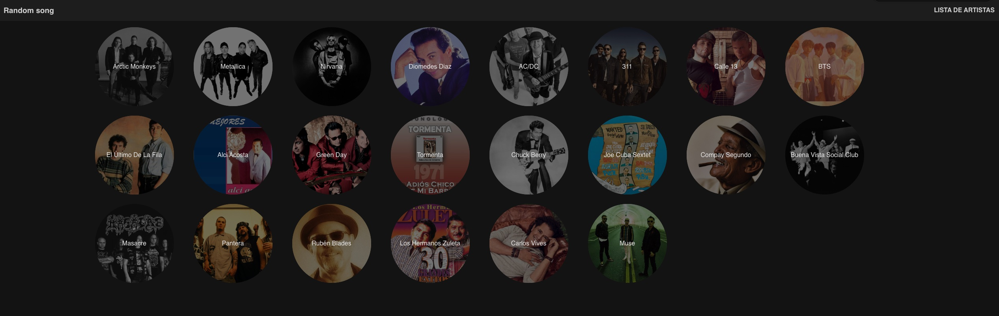
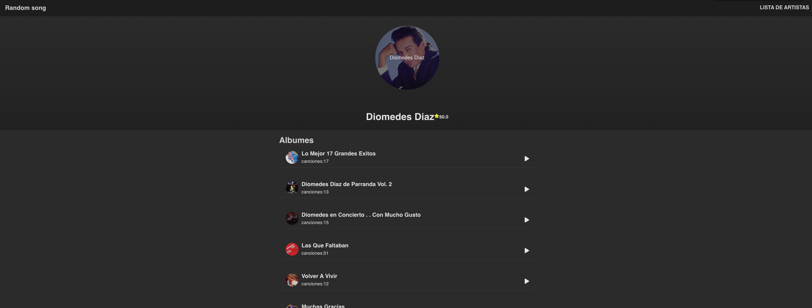
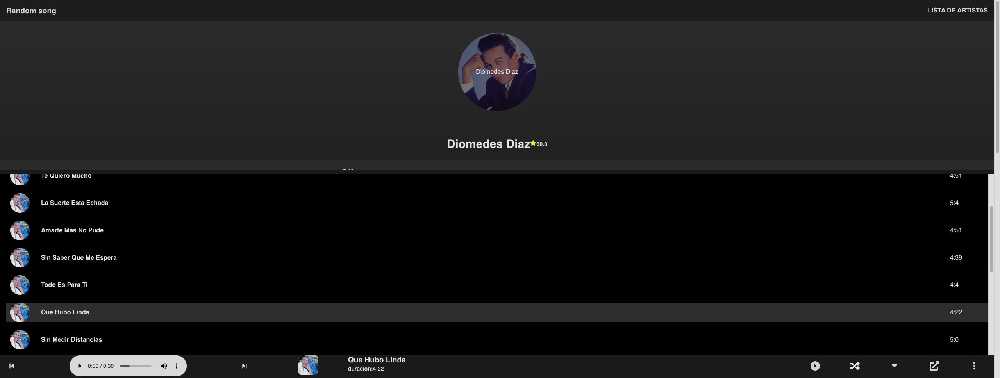

# Page - Frontend

Page with Vite, React, postcss and typescript.

### 🚀 Enlaces
 * **First Version:** [page](https://musiclistcesar.netlify.app/)

 some images of Projects:

 
 
 
 

#### 🛠 Installation of project
```
npm install
```

### 🖥 Execution
```
npm run dev
```

This project start in port http://localhost:3000

### 🛠️ Build with

The tools used
  * Frontend: React
  * css: postcss
  * typescript

### ✒️ Authors

* **César Galindo** - [chestergalindo](https://github.com/chestergalindo)

### 🎁 Expressions of Gratitude

* Comments a other people about this project. 📢
* Invite a beer 🍺 someone of team.